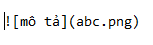
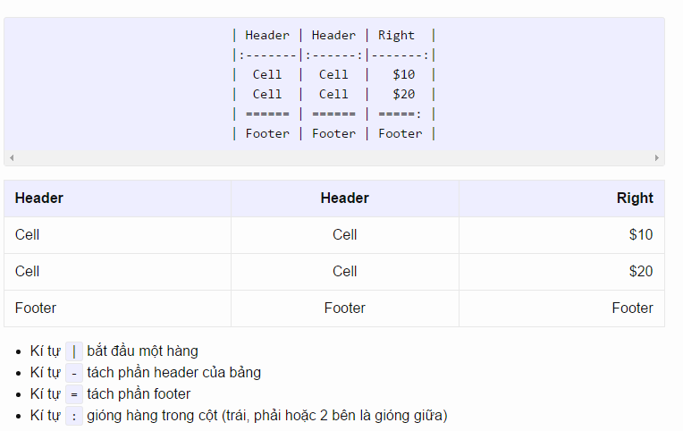

### MARKDOW LÀ GÌ

- Là ngôn ngữ đánh dấu với cú pháp văn bản thô

- Dễ dàng chuyển thành HTML và nhiều định dạng khác

- Dùng để tạo tệp readme, nhắn tin trên diễn đàn,..

### CÚ PHÁP THƯỜNG GẶP

##### 1.TIÊU ĐỀ
> 
# #(space)tiêu đề 1
> 
## ##(space)tiêu đề 2
> 
### ###(space)tiêu đề 3
> 
#### ####(space)tiêu đề 4
> 
##### #####(space)tiêu đề 5
> 
###### ######(space)tiêu đề 6

##### 2.XUỐNG DÒNG

> - Thêm 2 dấu cách ở cuối dòng
##### 3.CHỮ ĐẬM , NGHIÊNG 

>- ** **CHỮ ĐẬM**  **   

>- *CHỮ NGHIÊNG * 
##### 
4.LINK
 
Một liên kết được tạo bởi cặp móc nhọn bao quanh  
 
Vd: <dillinger.io>

##### 5.HÌNH ẢNH

 
 
##### 6.BẢNG
 